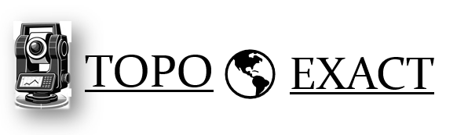
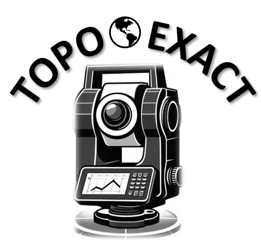

<!DOCTYPE html>
<html lang="es">
<head>
    <meta charset="UTF-8">
    <meta name="viewport" content="width=device-width, initial-scale=1.0">
    <title>TOPO EXACT | Servicios Topográficos y Geomática de Precisión</title>
    <!-- Carga de íconos FontAwesome -->
    <link href="https://cdnjs.cloudflare.com/ajax/libs/font-awesome/6.0.0/css/all.min.css" rel="stylesheet">
    
</head>
<body>

    <!-- Encabezado Principal con Logo -->
    <header>
        

            
        

        <nav>
            <a href="#">Inicio</a>
            <a href="#nosotros">Perfil</a>
            

                Servicios Técnicos <i class="fas fa-caret-down"></i>
                

                    <a href="#procesos">Control de Obra & Infraestructura</a>
                    <a href="#procesos">Nivelación & Altimetría</a>
                    <a href="#procesos">Geodesia Satelital & GNSS RTK</a>
                    <a href="#procesos">Agrimensura & Catastro</a>
                    <a href="#procesos">Sistemas SIG & Fotogrametría</a>
                

            

            <a href="#mercados">Mercados</a>
            <a href="#galeria">Trabajos en Terreno</a>
            <a href="#contacto">Contacto</a>
        </nav>
    </header>

    <!-- Portada Principal (Hero) -->
    <section class="hero">
        

            
        

        <h1>Servicios Topográficos y Geomática de Precisión</h1>
        
"TOPO EXACT, TE BRINDA TRABAJO DE CALIDAD"

        <a href="https://wa.me/573218626306?text=Hola,%20deseo%20cotizar%20un%20servicio%20topográfico%20con%20TOPO%20EXACT" class="btn-whatsapp" target="_blank">
            <i class="fab fa-whatsapp"></i> Contactar por WhatsApp
        </a>
    </section>

    

        <!-- Sección Quiénes Somos / Historia -->
        <section id="nosotros" class="about-section">
            

                

                    <h2>Nuestra Historia y Evolución</h2>
                    

                        Desde nuestra titulación técnica en topografía en 2016, hemos construido una sólida trayectoria en agrimensura, destacando 4 años de gestión rigurosa en el Ingenio Risaralda, así como en proyectos de obras viales, urbanismo y rectificación de áreas.
                    

                    

                        En 2023 alcanzamos un hito clave con la titulación profesional en <strong>Administración de Negocios</strong>, consolidando un perfil integral que combina la exactitud técnica en campo con la eficiencia gerencial. Tras participar activamente en procesos de restitución de tierras en la región, evolucionamos hacia <strong>TOPO EXACT</strong>: una firma que pone a disposición del sur de Colombia casi una década de experiencia, rigor administrativo y tecnología de vanguardia.
                    

                    <!-- Línea de Tiempo -->
                    

                        

                            <h4>2016 — Cimientos Técnicos y Experiencia en Campo</h4>
                            
Adecuación de tierras, canales de riego y control fotogramétrico en el Ingenio Risaralda, obras viales y urbanismo.

                        

                        

                            <h4>2023 — Visión Gerencial y Perfil Administrativo</h4>
                            
Titulación como Administrador de Negocios para la optimización de recursos y gestión transparente de proyectos técnicos.

                        

                        

                            <h4>Presente — Especialización Catastral y Topo Exact</h4>
                            
Georreferenciación y análisis espacial en Restitución de Tierras. Consolidación de TOPO EXACT como referente de calidad en el Sur de Colombia.

                        

                    

                

                

                    
                

            

            <!-- Misión y Visión -->
            

                

                    <h3><i class="fas fa-bullseye"></i> Misión</h3>
                    

                        Somos una empresa de origen quindiano radicada en Florencia, dedicada a brindar servicios de topografía e ingeniería de precisión en el departamento del Caquetá y gran parte del Huila. Nos comprometemos con el desarrollo de la región ofreciendo soluciones técnicas confiables, respaldadas por tecnología de punta y el rigor profesional de nuestro equipo.
                    

                

                

                    <h3><i class="fas fa-eye"></i> Visión</h3>
                    

                        Seremos una empresa líder en el sur del país que impulsará el desarrollo regional aplicando soluciones técnicas de vanguardia y nuevas tecnologías. Buscamos perfeccionar continuamente nuestros procesos para entregar resultados eficientes, exactos y legalmente confiables a cada uno de nuestros clientes.
                    

                

            

        </section>

        <!-- Portafolio Estratégico (Por Mercados) -->
        <section id="mercados">
            <h2 class="section-title">Soluciones Especializadas por Sector</h2>
            

                

                    <h3>🚜 Sector Agropecuario</h3>
                    <ul>
                        <li><strong>Agricultura 4.0:</strong> Mapas de salud vegetal (NDVI/SAVI) y topografía para diseño de riegos.</li>
                        <li><strong>Diseño de Predios:</strong> Trazado geométrico de potreros para ganadería sustentable y loteos rurales.</li>
                        <li><strong>Adecuación:</strong> Diseño de canales y perfiles para control de aguas.</li>
                    </ul>
                

                

                    <h3>⚖️ Sector Jurídico & Inmobiliario</h3>
                    <ul>
                        <li><strong>Agrimensura Legal:</strong> Deslindes, aclaración de linderos y peritajes técnicos certificados.</li>
                        <li><strong>Gestión Catastral:</strong> Memorias técnicas para IGAC, notarías y procesos de Restitución de Tierras.</li>
                        <li><strong>Urbanismo:</strong> Diseño y estructuración de loteos listos para procesos de escrituración.</li>
                    </ul>
                

                

                    <h3>🏗️ Construcción & Civil</h3>
                    <ul>
                        <li><strong>Fotogrametría Aérea:</strong> Modelos Digitales (MDT/MDE), ortoimágenes y mapas de teselas con drones.</li>
                        <li><strong>Control Estructural:</strong> Replanteo, verticalidad, aplomados y control de movimiento de tierras.</li>
                        <li><strong>Geodesia Vial:</strong> Trazado y control geométrico de vías (RTK/Estación Total).</li>
                    </ul>
                

            

        </section>

        <!-- Sección de Procesos y Servicios Técnicos (Con Imágenes del Cliente) -->
        <section id="procesos">
            <h2 class="section-title">Nuestros Procesos de Ingeniería</h2>
            

                

                    
                    

                        <h3>Control de Obra & Infraestructura</h3>
                        <ul>
                            <li>Replanteo de ejes, niveles y cimentaciones.</li>
                            <li>Control de excavaciones y movimiento de tierras.</li>
                            <li>Monitoreo estructural, aplomados y asentamientos.</li>
                            <li>Seguimiento en tiempo real con Estación Total.</li>
                        </ul>
                    

                

                

                    
                    

                        <h3>Nivelación & Altimetría</h3>
                        <ul>
                            <li>Nivelación geométrica con nivel óptico/digital.</li>
                            <li>Perfiles longitudinales y transversales.</li>
                            <li>Modelado digital de terrenos (redes TIN) y curvas.</li>
                            <li>Control de flujo de aguas en canales y acueductos.</li>
                        </ul>
                    

                

                

                    
                    

                        <h3>Geodesia Satelital & GNSS RTK</h3>
                        <ul>
                            <li>Posicionamiento milimétrico en tiempo real (RTK).</li>
                            <li>Amarrado oficial a la red nacional MAGNA-SIRGAS.</li>
                            <li>Georreferenciación de fincas y predios rurales.</li>
                            <li>Puntos de Control Terrestre (GCPs) para drones.</li>
                        </ul>
                    

                

                

                    
                    

                        <h3>Agrimensura & Gestión Catastral</h3>
                        <ul>
                            <li>Definición física y legal de linderos (deslindes).</li>
                            <li>Diseño geométrico de loteos y subdivisiones.</li>
                            <li>Elaboración de planos catastrales e informes.</li>
                            <li>Memorias técnicas para el IGAC y notarías.</li>
                        </ul>
                    

                

                

                    
                    

                        <h3>Sistemas SIG & Fotogrametría</h3>
                        <ul>
                            <li>Análisis espacial en ArcGIS Pro y QGIS.</li>
                            <li>Procesamiento de imágenes con Drones (UAS).</li>
                            <li>Mapas temáticos de ordenamiento territorial.</li>
                            <li>Estructuración de geodatabases catastrales.</li>
                        </ul>
                    

                

            

        </section>

        <!-- Galería Fotográfica de Trabajos en Terreno -->
        <section id="galeria" style="margin-top: 6rem;">
            <h2 class="section-title">Registro Fotográfico en Terreno</h2>
            

                

                    
                    
Control de Obra y Maquinaria en Terreno

                

                

                    
                    
Altimetría y Nivelación en Cuerpos de Agua

                

                

                    
                    
Georreferenciación de Corredores Viales

                

                

                    
                    
Agrimensura y Control de Canales

                

                

                    
                    
Levantamientos Topográficos Rurales

                

                

                    
                    
Levantamientos en Cultivos y Cañaduzales

                

            

        </section>

        <!-- Cobertura Territorial -->
        

            <h3><i class="fas fa-map-marked-alt"></i> Cobertura Operativa</h3>
            
Sede Principal en <strong>Florencia, Caquetá</strong> — Prestando servicios técnicos, topografía de precisión y consultoría especializada en <strong>Quindío, Caquetá, Huila</strong> y todo el <strong>Sur de Colombia</strong>.

        

    

    <!-- Pie de Página y Contacto -->
    <footer id="contacto">
        

            
        

        
"Te brinda trabajo de calidad"

        
        
<strong>Luis A. Beltrán B.</strong>

        
Topógrafo Profesional | Administrador de Negocios

        

            <a href="https://wa.me/573218626306" target="_blank" title="Escríbenos por WhatsApp"><i class="fab fa-whatsapp"></i></a>
            <a href="https://instagram.com/topoexact" target="_blank" title="Síguenos en Instagram"><i class="fab fa-instagram"></i></a>
            <a href="https://facebook.com/topoexact" target="_blank" title="Síguenos en Facebook"><i class="fab fa-facebook"></i></a>
            <a href="mailto:contacto@topoexact.com" title="Envíanos un Correo"><i class="fas fa-envelope"></i></a>
        

        
<i class="fas fa-phone footer-accent"></i> (+57) 321 862 6306

        
<i class="fas fa-envelope footer-accent"></i> contacto@topoexact.com

        
<i class="fas fa-map-marker-alt footer-accent"></i> Cobertura: Quindío, Caquetá, Huila & Sur de Colombia

        
        

            &copy; 2026 TOPO EXACT Ingeniería Topográfica & Gestión Territorial. Todos los derechos reservados.
        

    </footer>

</body>
</html>
